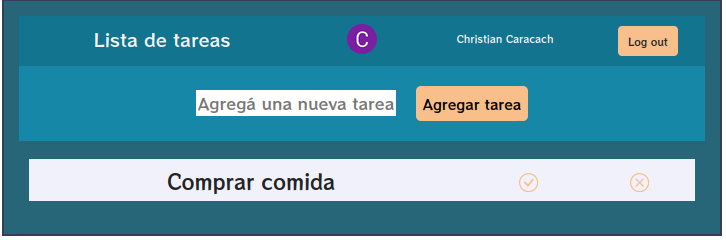
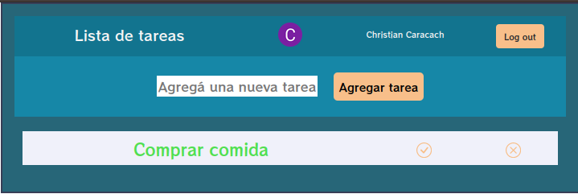

# React-todolist

This is a simple app to write down tasks to do.

I developed it as an initial project to understand React.

In it you can see the use of Props, Hooks, State and several features of this library.

First of all you will have to enter by authenticating with Google.

After entering you will see a field to enter the task you must perform, once loaded, it is shown at the bottom of the screen.

Each task can be deleted and marked as completed.

## Technologies used :

- HTML5
- CSS (Bootstrap)
- JS (React)
- Firebase

You can see this app deployed [HERE](https://todolistccaracach.web.app/)
